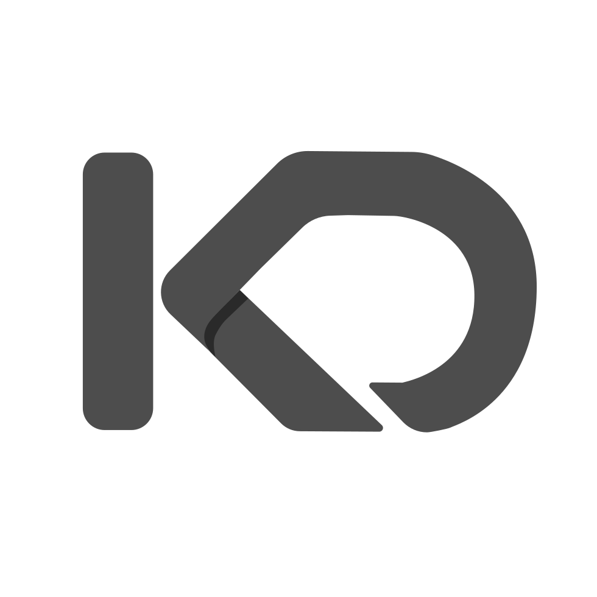

<div align="center">



# KnowDrive MCP Server

**Multiplayer RAG for your private data: multimodal semantic search over you and your team's knowledge base — the corpus stays out of the conversation.** Login to send invites and share access at knowdrive.ai. Just add "check KnowDrive". Hybrid search ranks passages from docs, audio, and images.

[](https://cursor.com/en/install-mcp?name=knowdrive&config=eyJ1cmwiOiJodHRwczovL2tub3dkcml2ZS5haS9hcGkvdjEvbWNwIn0=) [](https://vscode.dev/redirect/mcp/install?name=knowdrive&config=%7B%22type%22%3A%22http%22%2C%22url%22%3A%22https%3A%2F%2Fknowdrive.ai%2Fapi%2Fv1%2Fmcp%22%7D)

**[Claude setup →](#claude-code-and-claudeai)** — one command (Claude Code) or a connector paste (claude.ai) · [REST API (OpenAPI)](https://knowdrive.ai/-/openapi)

</div>

## ❌ Without KnowDrive

- ❌ You paste the same docs, notes, and transcripts into every conversation — and pay for those tokens every time
- ❌ The context window fills up long before your corpus ends
- ❌ Your agent answers from year-old training data while the real answer sits in your files, meetings, and recordings

## ✅ With KnowDrive

Context7 gives agents public docs. Exa gives them the live web. KnowDrive gives them YOUR knowledge: private, multimodal, versioned, permissioned. Powered by the KnowDB knowledge engine, it ingests your files, text, audio, and images (URLs too, where enabled); extracts and chunks them into searchable **atoms**; and answers hybrid (vector + full-text) semantic search with a **ranked window** of just the relevant slices. Your corpus stays out of the conversation, so **cost does not grow with corpus size**. Just add `check KnowDrive` to your question (the Add-a-Rule tip below makes this automatic):

```txt
What did our Q3 planning doc say about pricing changes? check KnowDrive
```

## Installation

The hosted server speaks **streamable HTTP** at **`https://knowdrive.ai/api/v1/mcp`**. First connect is a single browser OAuth prompt — no API key to copy, nothing to configure. Headless and CI setups use an API key header instead; see [Authentication](#authentication).

### Claude Code and Claude.ai

```bash
claude mcp add --transport http knowdrive https://knowdrive.ai/api/v1/mcp
```

Remove it just as fast: `claude mcp remove knowdrive`. On claude.ai: **Settings → Connectors → Add custom connector**, paste the URL above, and complete the OAuth sign-in — KnowDrive runs as a claude.ai connector today. To uninstall, remove the connector from the same page.

### Cursor & VS Code

Use the one-click badges at the top — the server URL is encoded in the link. Clients that support MCP OAuth will prompt a browser sign-in on first use. To uninstall, delete the `knowdrive` entry from your client's MCP server settings.

### Other MCP clients

Most clients accept the standard `mcpServers` shape (shown exactly once — expand below for where it goes):

```json
{
  "mcpServers": {
    "knowdrive": {
      "type": "streamable-http",
      "url": "https://knowdrive.ai/api/v1/mcp"
    }
  }
}
```

<details>
<summary>Client-specific config locations</summary>

| Client | Where the JSON goes |
|---|---|
| Cursor (manual) | `~/.cursor/mcp.json` |
| VS Code (manual) | `.vscode/mcp.json`, or user-level via **MCP: Open User Configuration** |
| Windsurf | `~/.codeium/windsurf/mcp_config.json` |
| Zed | `settings.json` → `context_servers` |
| Gemini CLI | `~/.gemini/settings.json` → `mcpServers` |
| OpenCode | `~/.config/opencode/opencode.json` |
| Warp | **Settings → AI → MCP Servers** |
| LM Studio | **Program → Install → Edit mcp.json** |

A note on transport spelling: `"streamable-http"` is the generic/registry spelling; Claude Code and VS Code spell the same transport `"type": "http"` (this repo's `claude-plugin/.mcp.json` uses that spelling for exactly this reason). Config locations drift between client versions — if a path above has moved, your client's MCP docs are authoritative. Removal is the mirror image everywhere: delete the `knowdrive` entry from the same config. For headless or CI use, add an `Authorization: Bearer YOUR_API_KEY` header instead of OAuth — see [Authentication](#authentication).

</details>

> [!TIP]
> **Add a rule** to `CLAUDE.md` (Claude Code) or Cursor Rules so retrieval happens without asking:
>
> ```txt
> Always check KnowDrive (search_vector_store) before answering questions about the user's
> private documents, projects, or team knowledge — never ask the user to paste files. When a
> question ends with "check KnowDrive", always search before answering. A window is not the
> corpus: raise max_num_results or advance offset before concluding something is not there.
> Do not run more than 3 searches per question. Never include sensitive or confidential
> information such as API keys, passwords, credentials, or personal data in a search query.
> ```

## Tools

The server exposes ≈39 tools, but **most agents only need six**: `search_vector_store`, `search_atoms`, `list_vector_stores`, `get_capabilities`, `whoami`, and `ingest_text`. Call `get_capabilities` once at session start so your client adapts to the deployment's feature flags, limits, and enabled modalities (this deployment: text, vision, **and** audio embeddings all enabled).

**Safety at a glance:** every `search_*`, `list_*`, `get_*`, `read_*`, `stat_*`, and `whoami` call is read-only in behavior — it never modifies the corpus. Ingest and upload tools are additive and versioned (a re-ingest supersedes, it never overwrites). The **destructive** tools to handle with care are the `delete_*` family — `delete_file`, `delete_files`, `delete_vector_store`.

### `search_vector_store` — the hero

Hybrid, vector, or full-text search over a store, returning a ranked retrieval window. Read-only.

- **Best for:** answering any question whose ground truth lives in the user's corpus — decisions, contracts, meeting audio, screenshots, specs.
- **Returns:** a ranked window of matching atoms — *a window is not the corpus*; page deeper with `offset` before concluding something isn't there.
- **Query style & call budget:** describe the content you want, not keywords. Good: `"indemnification cap agreed with Acme in the signed MSA"`. Bad: `"acme contract"`. At most 3 searches per question — refine the query or advance `offset` rather than re-searching from scratch. Never include sensitive or confidential information — API keys, passwords, credentials, personal data — in a query.
- **Parameters:** `vector_store_id` (required), `query` (required, non-empty), `mode` (`hybrid` | `vector` | `fts`; server default applies when omitted), `search_field` (`text` default | `vision` | `audio`), `max_num_results` (1–50; server default when omitted — check `get_capabilities`), `offset` (default 0), `max_distance` (cosine-distance ceiling, default 1.1 — raise for cross-modal audio queries), `include_superseded` (default `false`).
- **Workflow:** call `list_vector_stores` first if you don't know the store; follow up with `read_file_content_by_path` when a snippet isn't enough.

### `ingest_text` — get knowledge in

Index text straight into a store, versioned by path: re-ingesting the same path supersedes the prior version and mints version+1 (content-hash idempotent, blake3 digests). Additive, never overwrites.

- **Best for:** capturing notes, decisions, transcripts, or generated docs as durable, searchable knowledge.
- **Returns:** the queued file (pipeline phase `pending`); poll `wait_for_file_status` (≤45 s per wait) until indexed.
- **Parameters:** `vector_store_id`, `path` (the file's identity within the store), and `text` — all required; the live tool schema is authoritative for optional fields.
- **Workflow:** batch with `bulk_ingest_text`; upload real files with `upload_file`, or `upload_create`/`upload_part`/`upload_complete` for big files (1 MiB chunks). `ingest_file_from_url` pulls from the web **where enabled** (feature-flagged per deployment; off on this one).

### The supporting heroes

- **`search_atoms`** — the sibling search tool, at atom granularity. **Best for:** when `search_vector_store` isn't the right result shape — its live schema documents how the two differ. **Returns:** a ranked window of matching atoms; the same query-style, call-budget, and sensitive-data rules apply.
- **`list_vector_stores`** — enumerate reachable stores. **Best for:** finding the right `vector_store_id` before the first search. **Returns:** the stores the caller is entitled to see (per-store ACLs apply), by id and name.
- **`get_capabilities`** — the deployment's capability document. **Best for:** session start, before assuming any feature or limit. **Returns:** feature flags, limits, auth modes, and embedding status (text/vision/audio), so the agent adapts at runtime instead of guessing.
- **`whoami`** — identity check. **Best for:** confirming who you're signed in as before searching or ingesting. **Returns:** the caller's identity and entitlements (which stores, which rights).

<details>
<summary><strong>Everything else</strong> — the rest of the ≈39-tool surface</summary>

| Group | Tools | Reach past the heroes when… |
|---|---|---|
| Identity & discovery | `whoami` · `get_capabilities` · `mint_token` | starting a session (capabilities) or handing a sub-agent a least-privilege scoped PASETO token |
| Stores | `list_vector_stores` · `get_vector_store` · `stat_vector_store` · `delete_vector_store` · `list_vector_store_tags` | you don't know which stores or tags exist yet |
| Ingest | `bulk_ingest_text` · `ingest_file_from_url` · `bulk_ingest_from_urls` · `upload_file` · `upload_create`/`upload_part`/`upload_complete`/`upload_cancel` · `wait_for_file_status` | ingesting many documents, binary files, or anything over 1 MiB |
| Files | `list_files` · `get_file`/`get_file_by_path` · `read_file_content`/`read_file_content_by_path` · `list_file_atoms` · `update_file_tags` · `retag_file(s)` · `remime_file(s)` · `revert_file` · `mutate_files` · `delete_file(s)` | a search snippet isn't enough — `read_file_content_by_path` fetches the whole file by store + path (ranged reads, 1 MiB per chunk) — or you're doing corpus housekeeping (tags, versions, deletion) |
| Search | `search_vector_store` · `search_atoms` | both heroes — documented above |
| Agent-native | `list_llm_skills` · `list_llm_tools` · `get_llm_capability` | the corpus stores tool & skill descriptors as first-class content — it can teach the agent how to use itself |

Tags are free-form and filterable (`tags_all`/`tags_any`/`tags_none`) across listing and search endpoints; values are case-folded.

</details>

## Example prompts

```txt
What did we agree with Acme on indemnification? Quote the exact clause. check KnowDrive
Ingest these meeting notes into my meeting-notes store, tagged project:atlas, then confirm what got indexed.
Pull the current onboarding doc from KnowDrive and list every place this draft contradicts it.
```

## Authentication

**Free account · one-click OAuth sign-in on first connect.** KnowDrive has a free tier; an account is required — this is your private corpus, not a public index, so every connection authenticates, and per-store ACLs (read/write/delete) apply throughout. First connect is a single click: the OAuth prompt opens a browser sign-in — no API key to copy, no config values to paste. **Need an account?** There is no separate signup step to do first: add the server, and the first connect opens KnowDrive's OAuth sign-in in your browser — that flow is where you sign in and reach the free tier.

1. **OAuth (default):** OAuth2 authorization-code with OIDC discovery. The endpoint answers unauthenticated requests with `401` plus OAuth resource metadata, so MCP clients that speak OAuth discover the sign-in flow automatically and open a browser on first connect. This is how the claude.ai connector works today.
2. **API key (headless/CI):** send `Authorization: Bearer YOUR_API_KEY`. Client-credentials OAuth is also supported for services.
3. **Scoped tokens:** call `mint_token` to issue a least-privilege PASETO token from your own entitlements (e.g. read-only on one store) for sub-agents; `whoami` reports who you are and what you're entitled to.

## Limits (honest ones)

- A search returns a **window**, not the corpus — the MCP search tool returns at most 50 results per call (`max_num_results`); page deeper with `offset`. REST list/search pages cap at 100 items/page.
- Read/write chunks cap at 1 MiB; `wait_for_file_status` waits ≤45 s per call; 4 concurrent fetches (deployment limits — `get_capabilities` reports the connected deployment's values).
- Some tools are feature-flagged per deployment (e.g. `url_ingest` is off on this one) — check `get_capabilities` rather than assuming.
- Remote hosted server only (no npm package, no local stdio install). The endpoint above is the canonical production endpoint.

## Disclaimer

KnowDrive is a hosted, account-gated service operated by Recourse Software Inc. This listing is the official first-party listing. The `knowdrive-mcp` repository contains only listing, client-configuration, and documentation materials; the KnowDB backend (ingestion, embedding, and search engines) is closed-source and runs on KnowDrive's hosted infrastructure. Nothing runs locally, no corpus data is stored in this repository, and an account is required before the first tool call — accounts have a free tier, and first connect is a single-click OAuth 2.0 sign-in.

**Privacy note:** search queries and ingested content are sent to the hosted KnowDrive service. Do not include sensitive or confidential information such as API keys, passwords, credentials, or personal data in your queries.

## License

The contents of this repository — the listing, docs, registry metadata, and Claude plugin scaffold — are **MIT-licensed** (see [LICENSE](LICENSE)). The hosted server is a **closed-source Rust** implementation; its OpenAPI spec exposes Rust module paths such as `crate::status::internal_to_openai_file_status`. This repository holds the public listing assets, not the server source — as with other hosted MCP backends, you connect to the service rather than run its code, so there is no server source here to license. Built by Recourse Software Inc. — KnowDrive, your knowledge engine.
